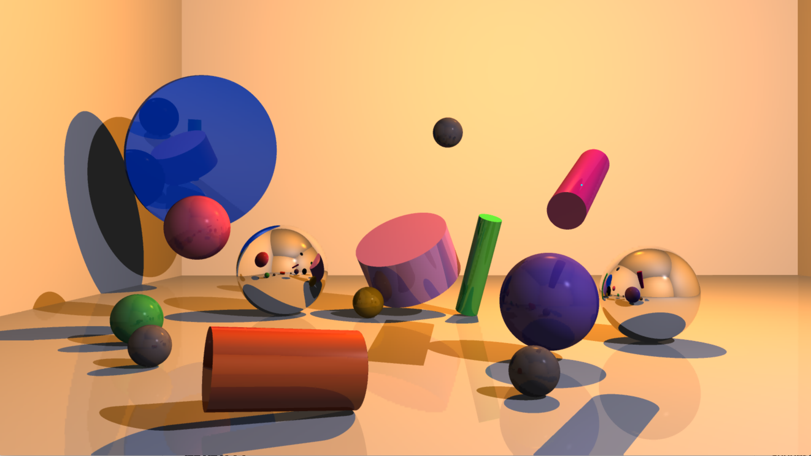
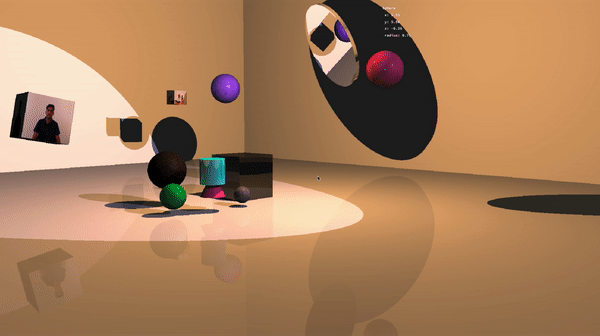

 

  

  <h3 align="center">MiniRT</h3>

  

    Ray Traced 3D Engine Written in C
     
     
    <a href="https://github.com/h-sarhan/miniRT">hsarhan</a>
    |
    <a href="https://github.com/Mohammed-Ehsan02">mkhan</a>
  

# About
miniRT is a 3D rendering engine based on the ray tracing algorithm. This project has a big focus on interactivity, you can move, rotate, and scale shapes in real-time with mouse and keyboard support. This project also supports more advanced features such as multi-threaded rendering, texture maps, reflections, anti-aliasing, and even a simple physics engine.

## Gallery

# Features
## Mandatory

* Rendering of 3D shapes like spheres, cylinders and planes
* Set shape properties like height, radius, position, and orientation before rendering
* Set camera position and orientation before rendering
* Set point light position, color, and intensity before rendering
* Phong model of lighting using ambient, diffuse, and specular components
* Shadows

## Bonus

* Edit mode: Edit shape properties like position, orientation, scale, and color in real-time
* Camera mode: Move camera around the scene
* Light mode: Edit light properties
* Mouse controls: Move and rotate shapes around with mouse input
* Look at animation: Pan the camera to a shape with the press of a button
* Multi-threaded rendering
* Spotlights
* Patterns
* Diffuse and normal texture mapping
* Additional shapes: Cone and cube
* Reflections
* Anti Aliasing

## Controls

`Space` to enter interactive mode

`WASD` or `mouse drag` to translate shapes

`Tab` or `mouse click` select different shapes

`Arrow keys` or `Shift + Mouse Drag` to rotate shapes

`C` to switch to camera mode

`WASD + Arrow Keys` to manipulate the camera

`O` to pan to an object

`J` for anti-aliasing

`H` for the rest of the controls
